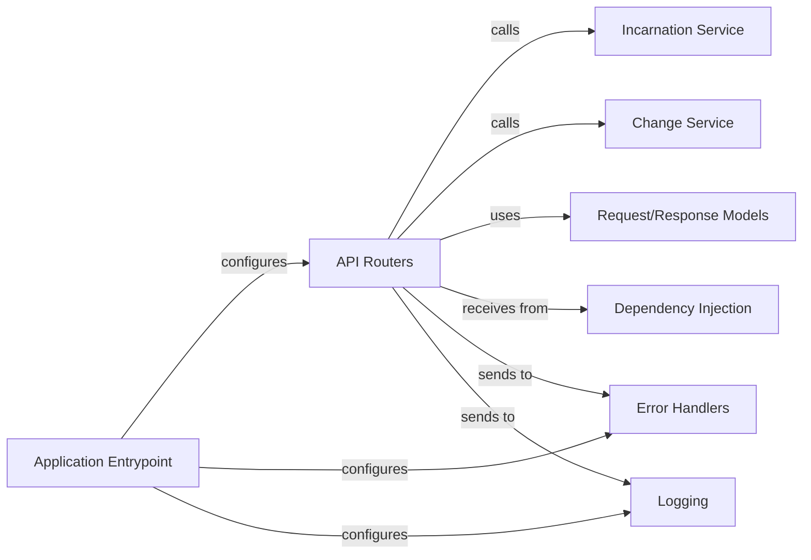

## Details

The API Layer serves as the external interface for Foxops, handling incoming HTTP requests, validating input, and routing them to the appropriate application services. It exposes the core functionalities of creating and managing incarnations and changes, adhering to the project's layered architecture.

### API Routers

These are the primary components of the API Layer, defining the HTTP endpoints (e.g., `/incarnations`, `/changes`) and handling incoming requests. They are responsible for initial request validation, parsing request bodies, and orchestrating the flow by delegating business logic execution to the appropriate services. They act as the direct interface for clients interacting with the Foxops system.

**Related Classes/Methods**:

- <a href="https://github.com/Roche/foxops/blob/main/src/foxops/routers/incarnations.py" target="_blank" rel="noopener noreferrer">`foxops.routers.incarnations`</a>

- <a href="https://github.com/Roche/foxops/blob/main/src/foxops/routers/changes.py" target="_blank" rel="noopener noreferrer">`foxops.routers.changes`</a>

- <a href="https://github.com/Roche/foxops/blob/main/src/foxops/routers/auth.py" target="_blank" rel="noopener noreferrer">`foxops.routers.auth`</a>

### Application Entrypoint

This component is the main entry point for the Foxops application. It initializes the FastAPI application instance, configures global middleware (like error handling and logging), and registers all the API Routers, making the defined endpoints accessible to incoming HTTP requests.

**Related Classes/Methods**:

- <a href="https://github.com/Roche/foxops/blob/main/src/foxops/__main__.py" target="_blank" rel="noopener noreferrer">`foxops.__main__`</a>

### Request/Response Models

These are Pydantic models used throughout the API Layer to define the structure, data types, and validation rules for data exchanged between clients and the API. They ensure data consistency, facilitate automatic API documentation (via OpenAPI/Swagger), and simplify data serialization/deserialization.

**Related Classes/Methods**:

- `foxops.models`

- <a href="https://github.com/Roche/foxops/blob/main/src/foxops/routers/changes.py" target="_blank" rel="noopener noreferrer">`foxops.routers.changes`</a>

### Incarnation Service

This component belongs to the Service Layer but is directly consumed by the API Routers. It encapsulates the core business logic for managing incarnations, including operations like creating new incarnations, updating existing ones, and retrieving their details. The API Routers delegate these complex operations to the Incarnation Service.

**Related Classes/Methods**:

- <a href="https://github.com/Roche/foxops/blob/main/src/foxops/services/incarnation.py" target="_blank" rel="noopener noreferrer">`foxops.services.incarnation`</a>

### Change Service

Similar to the Incarnation Service, this component from the Service Layer handles all business logic related to managing changes within incarnations. This includes applying template updates, creating merge requests, and managing the lifecycle of changes. API Routers call this service for change-related operations.

**Related Classes/Methods**:

- <a href="https://github.com/Roche/foxops/blob/main/src/foxops/services/change.py" target="_blank" rel="noopener noreferrer">`foxops.services.change`</a>

### Dependency Injection

This component is responsible for resolving and providing instances of required dependencies (such as service objects, repository objects, or configuration settings) to the API Routers and other components. It promotes loose coupling by allowing components to declare their dependencies without needing to know how they are constructed.

**Related Classes/Methods**:

- <a href="https://github.com/Roche/foxops/blob/main/src/foxops/dependencies.py" target="_blank" rel="noopener noreferrer">`foxops.dependencies`</a>

### Error Handlers

This component provides a centralized mechanism for catching and handling exceptions that occur within the API Layer or deeper in the application. It ensures that errors are transformed into consistent, client-friendly HTTP responses, improving the API's usability and predictability.

**Related Classes/Methods**:

- <a href="https://github.com/Roche/foxops/blob/main/src/foxops/error_handlers.py" target="_blank" rel="noopener noreferrer">`foxops.error_handlers`</a>

### Logging

This component provides structured logging capabilities across the application, including the API Layer. It's used to record incoming requests, outgoing responses, and any significant events or errors, which is vital for monitoring, debugging, and auditing the API's behavior.

**Related Classes/Methods**:

- <a href="https://github.com/Roche/foxops/blob/main/src/foxops/logger.py" target="_blank" rel="noopener noreferrer">`foxops.logger`</a>

### [FAQ](https://github.com/CodeBoarding/GeneratedOnBoardings/tree/main?tab=readme-ov-file#faq)