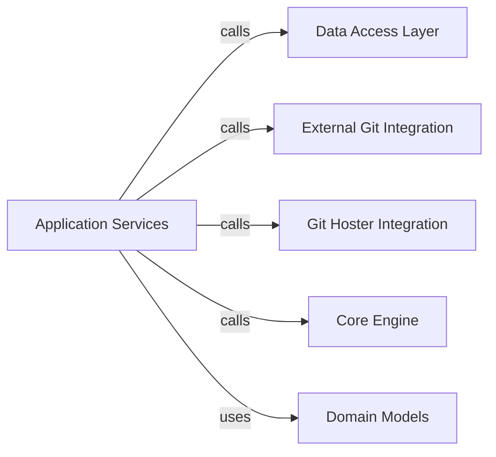

## Details

Analysis of the 'Application Services' component within the 'foxops' project, detailing its role, structure, and interactions with other key components like Data Access Layer, External Git Integration, Git Hoster Integration, Core Engine, and Domain Models. This component is crucial for orchestrating core business logic related to managing incarnations and changes.

### Application Services [[Expand]](./Application_Services.md)

This component encapsulates the core business logic and orchestrates complex workflows related to managing incarnations and changes within `foxops`. It acts as a mediator, coordinating interactions between the `Core Engine`, `Data Access Layer`, and `External Integration Layer` to fulfill business requirements. Its importance lies in centralizing and enforcing business rules, ensuring consistency, and decoupling the application's core functionality from lower-level concerns like data persistence and external API interactions.

**Related Classes/Methods**:

- <a href="https://github.com/Roche/foxops/blob/main/src/foxops/services/change.py#L114-L737" target="_blank" rel="noopener noreferrer">`foxops.services.change.ChangeService` (114:737)</a>

- <a href="https://github.com/Roche/foxops/blob/main/src/foxops/services/incarnation.py#L15-L44" target="_blank" rel="noopener noreferrer">`foxops.services.incarnation.IncarnationService` (15:44)</a>

### Data Access Layer [[Expand]](./Data_Access_Layer.md)

Handles data persistence and retrieval operations for the application.

**Related Classes/Methods**: _None_

### External Git Integration

Provides low-level Git operations and interacts with external Git repositories.

**Related Classes/Methods**: _None_

### Git Hoster Integration

Manages platform-specific Git operations and interactions with Git hosting platforms.

**Related Classes/Methods**: _None_

### Core Engine [[Expand]](./Core_Engine.md)

Performs fundamental GitOps operations such as templating and patching.

**Related Classes/Methods**: _None_

### Domain Models

Represents and manipulates business entities within the application.

**Related Classes/Methods**: _None_

### [FAQ](https://github.com/CodeBoarding/GeneratedOnBoardings/tree/main?tab=readme-ov-file#faq)