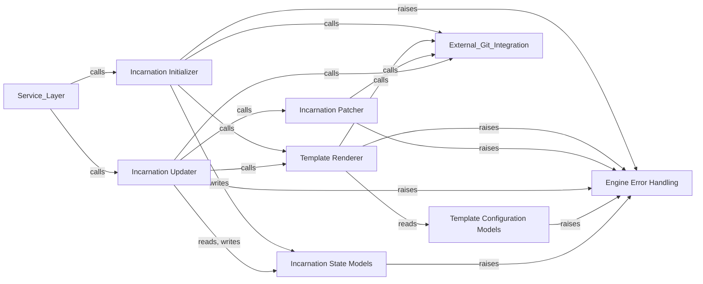

## Details

The Core Engine is the central nervous system of Foxops, orchestrating the fundamental GitOps operations. It's designed to be highly modular, with distinct components handling specific aspects of template-based repository management.

### Incarnation Initializer

This component is responsible for the initial creation of a new incarnation (a repository managed by Foxops) from a specified template. It involves cloning the template, rendering it with initial variables, and committing the result to a new incarnation repository.

**Related Classes/Methods**:

- <a href="https://github.com/Roche/foxops/blob/main/src/foxops/engine/initialization.py#L1-L1" target="_blank" rel="noopener noreferrer">`foxops/engine/initialization.py` (1:1)</a>

### Template Renderer

Handles the dynamic generation of content based on Jinja2 templates and provided variable data. It takes template files and a set of variables, producing the final rendered output that forms the basis of an incarnation.

**Related Classes/Methods**:

- <a href="https://github.com/Roche/foxops/blob/main/src/foxops/engine/rendering.py#L1-L1" target="_blank" rel="noopener noreferrer">`foxops/engine/rendering.py` (1:1)</a>

### Incarnation Patcher

Applies changes to an existing incarnation, typically in the form of Git diffs. This component is crucial for updating incarnations by merging new template versions or variable changes into the existing repository content.

**Related Classes/Methods**:

- `foxops/engine/patching.py` (1:1)

### Incarnation Updater

Orchestrates the entire update process for an existing incarnation. This involves fetching the latest template, rendering it, calculating the necessary patches, and applying them to the incarnation repository. It ensures that an incarnation stays synchronized with its template.

**Related Classes/Methods**:

- <a href="https://github.com/Roche/foxops/blob/main/src/foxops/engine/update.py#L1-L1" target="_blank" rel="noopener noreferrer">`foxops/engine/update.py` (1:1)</a>

### Template Configuration Models

Defines the data structures and validation logic for variables used in templates. These models ensure that template inputs conform to expected types and formats, preventing errors during rendering and patching.

**Related Classes/Methods**:

- <a href="https://github.com/Roche/foxops/blob/main/src/foxops/engine/models/template_config.py#L1-L1" target="_blank" rel="noopener noreferrer">`foxops/engine/models/template_config.py` (1:1)</a>

### Incarnation State Models

Represents the current state and metadata of an incarnation, including its template version, variables, and other relevant properties. These models are used to persist and retrieve the state of managed repositories.

**Related Classes/Methods**:

- <a href="https://github.com/Roche/foxops/blob/main/src/foxops/engine/models/incarnation_state.py#L1-L1" target="_blank" rel="noopener noreferrer">`foxops/engine/models/incarnation_state.py` (1:1)</a>

### Engine Error Handling

Defines custom exception types specific to the core engine's operations. This provides a structured way to communicate failures and allows for robust error management and user feedback.

**Related Classes/Methods**:

- <a href="https://github.com/Roche/foxops/blob/main/src/foxops/engine/errors.py#L1-L1" target="_blank" rel="noopener noreferrer">`foxops/engine/errors.py` (1:1)</a>

### [FAQ](https://github.com/CodeBoarding/GeneratedOnBoardings/tree/main?tab=readme-ov-file#faq)