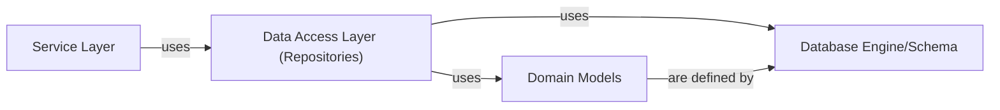

## Details

Component overview for the `Data Access Layer`, including its structure, flow, purpose, and relationships with other fundamental components in the `foxops` project.

### Data Access Layer (Repositories)

This layer implements the Repository Pattern, providing an abstraction over the persistence mechanism (SQLAlchemy, PostgreSQL/SQLite). It defines and implements interfaces for storing, retrieving, updating, and deleting `Incarnation` and `Change` entities, mapping between database-specific models and the application's domain models. It encapsulates the logic for interacting directly with the database.

**Related Classes/Methods**:

- <a href="https://github.com/Roche/foxops/blob/main/src/foxops/database/repositories/incarnation/repository.py#L1-L1000" target="_blank" rel="noopener noreferrer">`foxops.database.repositories.incarnation.repository` (1:1000)</a>

- <a href="https://github.com/Roche/foxops/blob/main/src/foxops/database/repositories/change/repository.py#L1-L1000" target="_blank" rel="noopener noreferrer">`foxops.database.repositories.change.repository` (1:1000)</a>

### Domain Models

Defines the SQLAlchemy ORM models that represent the core entities (`Incarnation`, `Change`) within the application's domain. These models serve as the data structures used by the `Data Access Layer` to interact with the database and by the `Service Layer` to represent business entities.

**Related Classes/Methods**:

- <a href="https://github.com/Roche/foxops/blob/main/src/foxops/database/repositories/incarnation/model.py#L1-L1000" target="_blank" rel="noopener noreferrer">`foxops.database.repositories.incarnation.model` (1:1000)</a>

- <a href="https://github.com/Roche/foxops/blob/main/src/foxops/database/repositories/change/model.py#L1-L1000" target="_blank" rel="noopener noreferrer">`foxops.database.repositories.change.model` (1:1000)</a>

### Service Layer

Contains the core business logic for managing `Incarnation` and `Change` entities. It orchestrates complex operations by interacting with the `Data Access Layer` to persist and retrieve data, and potentially with other external services (e.g., Git hosters). It ensures that business rules and workflows are correctly applied.

**Related Classes/Methods**:

- <a href="https://github.com/Roche/foxops/blob/main/src/foxops/services/incarnation.py#L1-L1000" target="_blank" rel="noopener noreferrer">`foxops.services.incarnation` (1:1000)</a>

- <a href="https://github.com/Roche/foxops/blob/main/src/foxops/services/change.py#L1-L1000" target="_blank" rel="noopener noreferrer">`foxops.services.change` (1:1000)</a>

### Database Engine/Schema

Manages the underlying database connection, session handling, and defines the database schema (tables, relationships) using SQLAlchemy. It provides the foundational infrastructure for data persistence, enabling the `Data Access Layer` to interact with the physical database.

**Related Classes/Methods**:

- <a href="https://github.com/Roche/foxops/blob/main/src/foxops/database/schema.py#L1-L1000" target="_blank" rel="noopener noreferrer">`foxops.database.schema` (1:1000)</a>

- `foxops.database.database` (1:1000)

### [FAQ](https://github.com/CodeBoarding/GeneratedOnBoardings/tree/main?tab=readme-ov-file#faq)