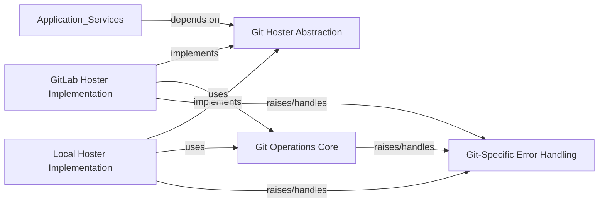

## Details

The `External Integration Layer` in `foxops` provides a robust and unified interface for interacting with various Git hosting platforms, abstracting away their specific details. This layer is crucial for a DevOps/GitOps automation tool as it enables seamless communication with source code repositories, a core requirement for managing infrastructure as code and application deployments.

### Git Hoster Abstraction

This component defines a generic interface (`Hoster`) that abstracts the specific details of different Git hosting platforms. This allows the higher-level application logic to interact with any supported hoster in a uniform manner, promoting loose coupling and extensibility. It defines the contract for hoster-specific operations like creating merge requests, checking project existence, and retrieving reconciliation statuses.

**Related Classes/Methods**:

- <a href="https://github.com/Roche/foxops/blob/main/src/foxops/hosters/types.py#L1-L1" target="_blank" rel="noopener noreferrer">`foxops/hosters/types.py` (1:1)</a>

### GitLab Hoster Implementation

This component provides the concrete implementation of the `Hoster` interface specifically for GitLab. It handles API calls unique to GitLab for tasks such as managing merge requests, verifying project existence, and fetching reconciliation statuses, translating generic `Hoster` operations into GitLab-specific API interactions.

**Related Classes/Methods**:

- <a href="https://github.com/Roche/foxops/blob/main/src/foxops/hosters/gitlab.py#L1-L1" target="_blank" rel="noopener noreferrer">`foxops/hosters/gitlab.py` (1:1)</a>

### Local Hoster Implementation

This component provides a local, file-system-based implementation of the `Hoster` interface. It is primarily used for testing, development, and potentially local dry-runs, simulating Git hoster functionalities (like merge requests) without requiring a live remote Git service. It manages local repositories and simulates merge request workflows within the file system.

**Related Classes/Methods**:

- <a href="https://github.com/Roche/foxops/blob/main/src/foxops/hosters/local.py#L1-L1" target="_blank" rel="noopener noreferrer">`foxops/hosters/local.py` (1:1)</a>

### Git Operations Core

This component provides the foundational capabilities for interacting with Git repositories locally. It encapsulates low-level Git commands and manages the state of a local Git working directory. It acts as the direct interface to Git CLI operations, ensuring consistent and reliable execution of Git commands such as cloning, committing, and pushing.

**Related Classes/Methods**:

- <a href="https://github.com/Roche/foxops/blob/main/src/foxops/external/git.py#L1-L1" target="_blank" rel="noopener noreferrer">`foxops/external/git.py` (1:1)</a>

### Git-Specific Error Handling

This component defines a hierarchy of custom exceptions specifically for Git-related operations. This allows for precise error handling and clearer communication of issues originating from Git interactions, distinguishing them from other application errors and enabling specific recovery strategies.

**Related Classes/Methods**:

- <a href="https://github.com/Roche/foxops/blob/main/src/foxops/external/git.py#L1-L1" target="_blank" rel="noopener noreferrer">`foxops/external/git.py` (1:1)</a>

- <a href="https://github.com/Roche/foxops/blob/main/src/foxops/errors.py#L1-L1" target="_blank" rel="noopener noreferrer">`foxops/errors.py` (1:1)</a>

### [FAQ](https://github.com/CodeBoarding/GeneratedOnBoardings/tree/main?tab=readme-ov-file#faq)