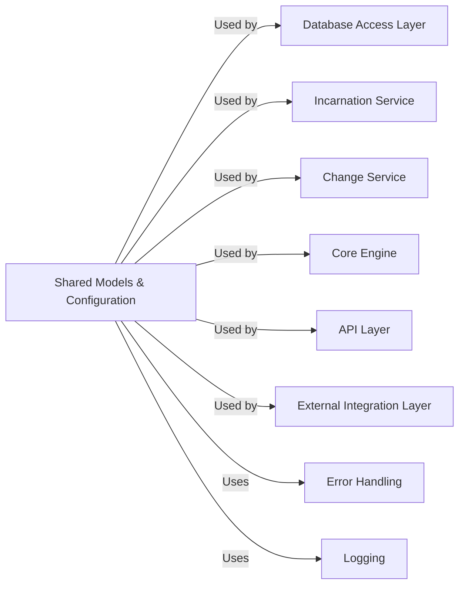

## Details

The `Shared Models & Configuration` component is a foundational element within the `foxops` project, crucial for maintaining data consistency, type safety, and centralized management of application settings and dependencies. It effectively combines the responsibilities of defining core domain entities and providing a robust configuration mechanism, aligning with the project's architectural patterns of Domain-Driven Design and Dependency Injection.

### Shared Models & Configuration [[Expand]](./Shared_Models_Configuration.md)

This foundational component defines the core data structures (Domain Models) used throughout the application, ensuring consistency and type safety. These models represent the key entities and their relationships within the `foxops` domain, such as `Incarnation`, `Change`, `IncarnationState`, and `TemplateConfig`. They are primarily Pydantic models used for data validation, serialization, and deserialization across different layers (API, Service, Engine), embodying elements of Domain-Driven Design. Additionally, this component is responsible for loading and providing application-wide and database-specific settings. It ensures that various parts of the application can access necessary configurations in a centralized and type-safe manner, leveraging `pydantic-settings` for environment variable and settings file management. It also provides a mechanism for dependency injection across all layers, ensuring that services and other components receive their required dependencies (like settings, database connections, or hoster instances) in a controlled and testable manner.

**Related Classes/Methods**:

- <a href="https://github.com/Roche/foxops/blob/main/src/foxops/models/change.py#L1-L1" target="_blank" rel="noopener noreferrer">`foxops.models.change` (1:1)</a>

- <a href="https://github.com/Roche/foxops/blob/main/src/foxops/models/incarnation.py#L1-L1" target="_blank" rel="noopener noreferrer">`foxops.models.incarnation` (1:1)</a>

- <a href="https://github.com/Roche/foxops/blob/main/src/foxops/engine/models/incarnation_state.py#L1-L1" target="_blank" rel="noopener noreferrer">`foxops.engine.models.incarnation_state` (1:1)</a>

- <a href="https://github.com/Roche/foxops/blob/main/src/foxops/engine/models/template_config.py#L1-L1" target="_blank" rel="noopener noreferrer">`foxops.engine.models.template_config` (1:1)</a>

- <a href="https://github.com/Roche/foxops/blob/main/src/foxops/settings.py#L1-L1" target="_blank" rel="noopener noreferrer">`foxops.settings` (1:1)</a>

- <a href="https://github.com/Roche/foxops/blob/main/src/foxops/dependencies.py#L1-L1" target="_blank" rel="noopener noreferrer">`foxops.dependencies` (1:1)</a>

### Database Access Layer

**Related Classes/Methods**: _None_

### Incarnation Service

**Related Classes/Methods**: _None_

### Change Service

**Related Classes/Methods**: _None_

### Core Engine [[Expand]](./Core_Engine.md)

**Related Classes/Methods**: _None_

### API Layer [[Expand]](./API_Layer.md)

**Related Classes/Methods**: _None_

### External Integration Layer [[Expand]](./External_Integration_Layer.md)

**Related Classes/Methods**: _None_

### Error Handling

**Related Classes/Methods**: _None_

### Logging

**Related Classes/Methods**: _None_

### [FAQ](https://github.com/CodeBoarding/GeneratedOnBoardings/tree/main?tab=readme-ov-file#faq)