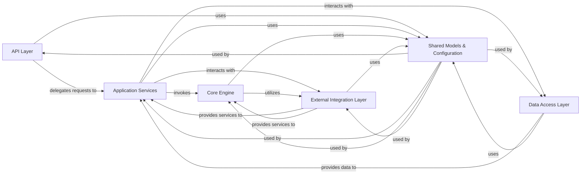

## Details

The `foxops` project, a DevOps/GitOps automation tool, exhibits a clear layered architecture with strong adherence to modularity and separation of concerns. The analysis of its Control Flow Graph (CFG) and source code reveals a well-structured system designed for maintainability and extensibility.

### API Layer [[Expand]](./API_Layer.md)

Serves as the external interface for Foxops, handling incoming HTTP requests, validating input, and routing them to the appropriate application services. It exposes the core functionalities of creating and managing incarnations and changes.

**Related Classes/Methods**:

- `foxops.routers`

- <a href="https://github.com/Roche/foxops/blob/main/src/foxops/__main__.py" target="_blank" rel="noopener noreferrer">`foxops.__main__`</a>

### Application Services [[Expand]](./Application_Services.md)

Encapsulates the core business logic and orchestrates complex workflows related to managing incarnations and changes. It acts as a mediator, coordinating interactions between the Core Engine, Data Access Layer, and External Integration Layer to fulfill business requirements.

**Related Classes/Methods**:

- <a href="https://github.com/Roche/foxops/blob/main/src/foxops/services/change.py" target="_blank" rel="noopener noreferrer">`foxops.services.change`</a>

- <a href="https://github.com/Roche/foxops/blob/main/src/foxops/services/incarnation.py" target="_blank" rel="noopener noreferrer">`foxops.services.incarnation`</a>

### Core Engine [[Expand]](./Core_Engine.md)

Contains the fundamental logic for GitOps operations, including template rendering, initializing new incarnations, and applying patches to update existing ones. This is the heart of Foxops' automation capabilities.

**Related Classes/Methods**:

- <a href="https://github.com/Roche/foxops/blob/main/src/foxops/engine/initialization.py" target="_blank" rel="noopener noreferrer">`foxops.engine.initialization`</a>

- <a href="https://github.com/Roche/foxops/blob/main/src/foxops/engine/rendering.py" target="_blank" rel="noopener noreferrer">`foxops.engine.rendering`</a>

- `foxops.engine.patching`

- <a href="https://github.com/Roche/foxops/blob/main/src/foxops/engine/update.py" target="_blank" rel="noopener noreferrer">`foxops.engine.update`</a>

### Data Access Layer [[Expand]](./Data_Access_Layer.md)

Provides an abstraction over the persistence mechanism, handling CRUD (Create, Read, Update, Delete) operations for `Incarnation` and `Change` entities. It maps between database-specific models and the application's domain models.

**Related Classes/Methods**:

- `foxops.database.repositories`

### External Integration Layer [[Expand]](./External_Integration_Layer.md)

Offers a unified interface for interacting with various Git hosting platforms (e.g., GitLab, local file system). It abstracts away the specifics of each hoster, providing common Git operations like cloning, committing, pushing, and managing merge requests.

**Related Classes/Methods**:

- `foxops.hosters`

- <a href="https://github.com/Roche/foxops/blob/main/src/foxops/external/git.py" target="_blank" rel="noopener noreferrer">`foxops.external.git`</a>

### Shared Models & Configuration [[Expand]](./Shared_Models_Configuration.md)

This foundational component defines the core data structures (Domain Models) used throughout the application, ensuring consistency and type safety. It also manages application settings, environment variables, and provides a mechanism for dependency injection across all layers.

**Related Classes/Methods**:

- `foxops.models`

- `foxops.engine.models`

- <a href="https://github.com/Roche/foxops/blob/main/src/foxops/dependencies.py" target="_blank" rel="noopener noreferrer">`foxops.dependencies`</a>

- <a href="https://github.com/Roche/foxops/blob/main/src/foxops/settings.py" target="_blank" rel="noopener noreferrer">`foxops.settings`</a>

### [FAQ](https://github.com/CodeBoarding/GeneratedOnBoardings/tree/main?tab=readme-ov-file#faq)