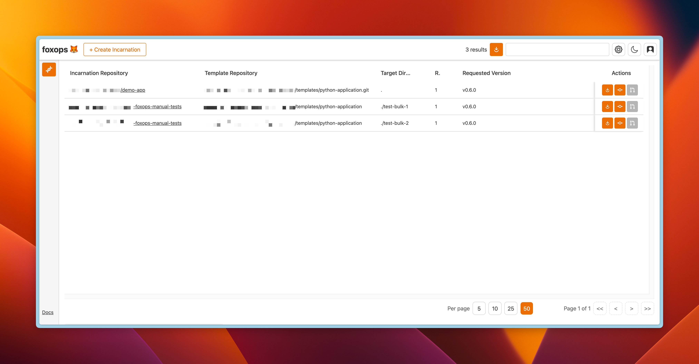

# foxops 🦊

Foxops is a tool that helps to create Git repositories from a template file structure. It serves as a central tool for maintaining an overview of all repositories created from a template, including their versions and the data used to fill placeholders.

Moreover, foxops can keep these repositories up-to-date with any changes made to the template, even if changes were made to the target repository ('incarnation') in the meantime.

Some example use cases for this tool include:
* Keeping multiple microservice repositories updated with a common CI/CD configuration or build tooling template
* Managing a number of infrastructure-as-code repositories based on a common template (e.g., dev/staging/prod environments)

## Documentation

The documentation and installation instructions are available here: https://foxops.readthedocs.io

## Alternatives

* [cookiecutter](https://github.com/cookiecutter/cookiecutter) - probably one of the most popular file-system templating tools
* [copier](https://github.com/copier-org/copier) - another CLI application for file-system templating
