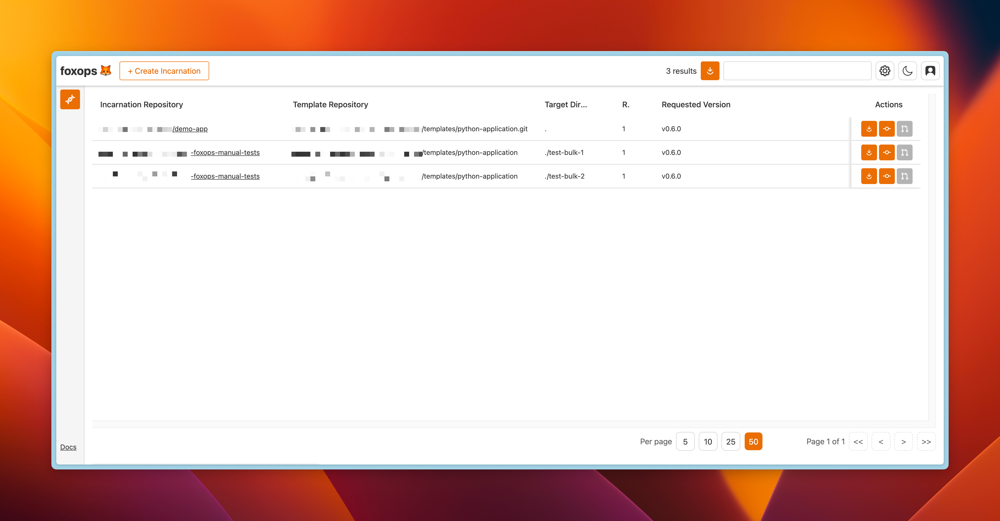

# Usage

## Using the FoxOps UI



The foxops UI is the main interface to interact with foxops "as a human". It can be used to:

* Create new incarnations
* View and search existing incarnations
* Update existing incarnations (update them to a newer template version or change variable values)
* Perform bulk updates on many incarnations

## Terraform Provider

FoxOps also provides a [Terraform Provider](https://registry.terraform.io/providers/Roche/foxops/latest/docs) that can be used to manage incarnations from Terraform.

This is especially useful in combination with the [Gitlab Provider](https://registry.terraform.io/providers/gitlabhq/gitlab/latest/docs) - to create new projects and immediately initialize them from a foxops template.

## HTTP API

FoxOps also provides an HTTP API that can be used to manage incarnations programmatically. Its documentation is available at the `/docs` URL of your foxops instance and it offers the same functionality as the UI.

To call the API, the same authentication token must be used as when logging in to the UI.

Provide it with a `Authorization: Bearer <your-token>` header.

### Python Client Library

If you want to use the foxops API directly from Python, you can use the prebuilt client library (based on httpx): [https://github.com/Roche/foxops-client-python](https://github.com/Roche/foxops-client-python)

## Local Development with _fengine_

The `fengine` CLI tool is especially useful when you're working on a template,
as it allows you to quickly create or update an incarnation locally to test your changes.

```{warning}
Be aware that fengine should not be used to work with incarnations that are managed by a foxops instance - as this can cause the foxops database to get out-of-sync.
```

(bootstrap-a-template)=
### Bootstrap a Template

fengine is able to bootstrap a new template in a folder you specify, e.g. to create a new template in the `catcam` folder,
run the following command:

```sh
fengine new catcam
```

This will scaffold the following structure:

* `fengine.yaml`: a basic template configuration file with a predefined `author` variable.
* `template/README.md`: a markdown template file which will render the string `Created by {{ author }}` to the incarnation
                        whereas `{{ author }}` will be replaced by the actual value fo the incarnation.

To create a proper template we will initialize the `catcam` directory as Git repository and create a commit and first tag:

```sh
git init catcam
cd catcam
git add .
git commit -a -m 'Initial commit'
git tag v1.0.0
```

### Initialize an Incarnation

The `fengine initialize` command can be used to create a local incarnation of a template.
To create an incarnation in the `mycat` folder from the `catcam` template created in [Bootstrap a Template](#bootstrap-a-template)
with the `author` name `Albert Einstein` use the following command:

```sh
fengine initialize catcam/ --template-version v1.0.0 mycat -d author="Albert Einstein"
```

This will create the `mycat/` folder and render the file `README.md` with the contents:

```text
Created by Albert Einstein
```

In addition, it also render a special file called `.fengine.yaml` which is owned by foxops
and shouldn't be manually edited. It's sole purpose is to calculate updates and have a reference
to the underlying template and its version.
It may look something like this:

```yaml
# This file is auto-generated and owned by foxops.
# DO NOT EDIT MANUALLY.
template_data:
  author: Albert Einstein
template_repository: /Users/.../catcam
template_repository_version: v1.0.0
template_repository_version_hash: 437b0efc7c6515e1ec613d08ce70a9a1d84fe7dc
```

### Update an incarnation

Let's assume the template as updated and a `v2.0.0` version exists
and is available in the local `catcam` template directory.

You can update the `mycat` incarnation using the following command:

```sh
fengine update mycat/ -u v2.0.0
```

You may also provide other values for the template data like the `author` variable.
```
